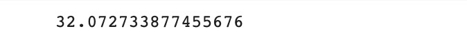
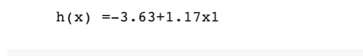
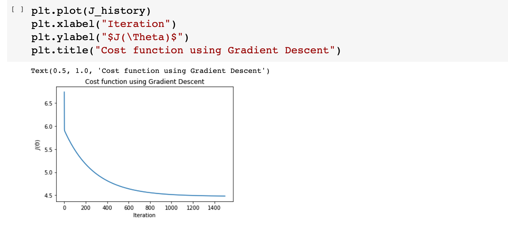

# Implementation-of-Linear-Regression-Using-Gradient-Descent

## AIM:
To write a program to predict the profit of a city using the linear regression model with gradient descent.

## Equipments Required:
1. Hardware – PCs
2. Anaconda – Python 3.7 Installation / Jupyter notebook

## Algorithm
1. Use the standard libraries in python for Gradient Design.

2. Upload the dataset and check any null value using .isnull() function.

3. Declare the default values for linear regression.

4. Calculate the loss usinng Mean Square Error.

5. Predict the value of y.

6. Plot the graph respect to hours and scores using scatter plot function.


## Program:
```
/*
Program to implement the linear regression using gradient descent.
Developed by: K.Jhansi
RegisterNumber:  212221230045
*/
import numpy as np
import pandas as pd
import matplotlib.pyplot as plt

df=pd.read_csv("ex1.txt",header=None)

plt.scatter(df[0],df[1])
plt.xticks(np.arange(5,30,step=5))
plt.yticks(np.arange(-5,30,step=5))
plt.xlabel("Population of City (10,000s)")
plt.ylabel("Profit($10,000)")
plt.title("Profit Prediction")


def computeCost(X,y,theta):
    m=len(y) #length of the training data
    h=X.dot(theta) #hypothesis
    square_err=(h-y)**2
    
    return 1/(2*m)*np.sum(square_err) #returning J

df_n=df.values
m=df_n[:,0].size
X=np.append(np.ones((m,1)),df_n[:,0].reshape(m,1),axis=1)
y=df_n[:,1].reshape(m,1)
theta=np.zeros((2,1))

computeCost(X,y,theta) #call the function


def gradientDescent(X,y,theta,alpha,num_iters):
    m=len(y)
    J_history=[]
    
    for i in range(num_iters):
        predictions = X.dot(theta)
        error = np.dot(X.transpose(),(predictions -y))
        descent = alpha*(1/m )*error
        theta-=descent
        J_history.append(computeCost(X,y,theta))
    return theta,J_history

theta,J_history = gradientDescent(X,y,theta,0.01,1500)
print("h(x)="+str(round(theta[0,0],2))+"+"+str(round(theta[1,0],2))+"x1")

#Testing the implementation
plt.plot(J_history)
plt.xlabel("Iteration")
plt.ylabel("$J(\Theta)$")
plt.title("Cost function using Gradient Descent")

plt.scatter(df[0],df[1])
x_value=[x for x in range(25)]
y_value=[y*theta[1]+theta[0]for y in x_value]
plt.plot(x_value,y_value,color="purple")
plt.xticks(np.arange(5,30,step=5))
plt.yticks(np.arange(-5,30,step=5))
plt.xlabel("Population of City (10,000s)")
plt.ylabel("Profit($10,000)")
plt.title("Profit Prediction")

def predict(x,theta):
    predictions = np.dot(theta.transpose(),x)
    return predictions[0]

predict1=predict(np.array([1,3.5]),theta)*10000
print("For population = 35,000 , we predict a profit of $"+str(round(predict1,0)))

predict2=predict(np.array([1,7]),theta)*10000
print("For population = 70,000 , we predict a profit of $"+str(round(predict2,0)))

```

## Output:






## Result:
Thus the program to implement the linear regression using gradient descent is written and verified using python programming.
